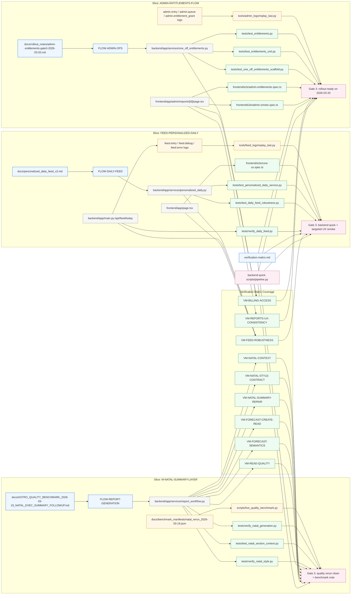

# GRACE Artifacts Index

> Legacy artifact inventory with some tooling dependencies. Prefer `docs/GRACE_HOME.md` for the project GRACE home and `docs/REGRESSION_MAP.md` for the master regression map. Keep this file for inventory/history until tooling migrates.

## Overview

`docs/GRACE_ARTIFACTS.md` — это рабочий индекс ближайших GRACE-слайсов. Он фиксирует, какие артефакты уже существуют, где лежат prompts/templates и какой минимальный regression-профиль должен быть зелёным, прежде чем двигаться от baseline-документации к feature rollout.

Цель файла — дать одну точку входа для Architect / Developer / QA: быстро понять текущий статус по `M-NATAL-SUMMARY-LAYER`, `FEED-PERSONALIZED-DAILY` и `ADMIN-ENTITLEMENTS-FLOW`, не собирая контекст вручную из `docs/`, `backend/`, `frontend/` и `tests/`.

## Artifacts Inventory

| Slice | Artifact | Owner | Status |
| --- | --- | --- | --- |
| `FORECAST-LADDER-CATALOG-FLIP` | `GRACE_SLICE_FORECAST_LADDER.md` | Architect | Baseline doc |
| `FORECAST-LADDER-CATALOG-FLIP` | `frontend/app/reports/page.tsx`; `frontend/app/reports/history/page.tsx`; `frontend/components/consumer-page-shell.tsx`; `frontend/lib/product-billing.ts` | AI Agent (Developer) | In Progress |
| `FORECAST-LADDER-CATALOG-FLIP` | `backend/app/services/access_control.py`; `backend/app/services/one_off_entitlements.py`; `backend/app/services/report_workflow.py`; `backend/app/core/config_business.py` | AI Agent (Developer) | In Progress |
| `FORECAST-LADDER-CATALOG-FLIP` | `docs/BILLING_CATALOG_ALIGNMENT_2026-03-19.md`; `docs/REPORT_STRUCTURES.md`; `docs/SYNASTRY_SOLAR_CREATE_CLEANUP_2026-03-19.md` | Architect | Baseline |
| `FORECAST-LADDER-CATALOG-FLIP` | `frontend/e2e/billing-catalog-alignment.spec.ts`; `frontend/e2e/history-cta.spec.ts`; `frontend/e2e/month-forecast-bridge-storefront.spec.ts`; `frontend/e2e/year-forecast-bridge-storefront.spec.ts`; `frontend/e2e/solar-return-bridge-storefront.spec.ts`; `frontend/e2e/synastry-bridge-storefront.spec.ts`; `frontend/e2e/report-create.spec.ts`; `frontend/e2e/report-failure.spec.ts` | AI Agent (QA) | In Progress |
| `FORECAST-LADDER-CATALOG-FLIP` | `tests/test_billing_checkout_sessions.py`; `tests/test_billing_checkout_resume.py`; `tests/test_one_off_access_runtime.py`; `tests/test_one_off_entitlements_scaffold.py`; `tests/test_legacy_workflow_one_off_alignment.py`; `tests/test_report_contract.py` | AI Agent (QA) | In Progress |
| `M-NATAL-SUMMARY-LAYER` | `docs/ASTRO_QUALITY_BENCHMARK_2026-03-19_NATAL_EXEC_SUMMARY_FOLLOWUP.md` | AI Agent (Developer/QA) | In Progress |
| `M-NATAL-SUMMARY-LAYER` | `docs/benchmark_manifests/natal_rerun_2026-03-19.json` | AI Agent (QA) | Ready |
| `M-NATAL-SUMMARY-LAYER` | `backend/app/services/report_workflow.py` | AI Agent (Developer) | In Progress |
| `M-NATAL-SUMMARY-LAYER` | `tests/verify_natal_generation.py` | AI Agent (QA) | Ready |
| `M-NATAL-SUMMARY-LAYER` | `tests/test_natal_section_context.py` | AI Agent (QA) | Ready |
| `M-NATAL-SUMMARY-LAYER` | `tests/verify_natal_style.py` | AI Agent (QA) | Ready |
| `FEED-PERSONALIZED-DAILY` | `docs/personalized_daily_feed_v2.md` | AI Agent (Developer/QA) | Ready |
| `FEED-PERSONALIZED-DAILY` | `backend/app/services/personalized_daily.py` | AI Agent (Developer) | Ready |
| `FEED-PERSONALIZED-DAILY` | `backend/app/main.py` (`/api/feed/today`, `/api/day/brief`); `backend/app/services/day_brief.py` | AI Agent (Developer) | In Progress |
| `FEED-PERSONALIZED-DAILY` | `tests/test_day_brief.py`; `tests/test_personalized_daily_service.py`; `tests/test_daily_feed_robustness.py` | AI Agent (QA) | In Progress |
| `FEED-PERSONALIZED-DAILY` | `tests/test_personalized_daily_service.py` | AI Agent (QA) | Ready |
| `FEED-PERSONALIZED-DAILY` | `tests/test_daily_feed_robustness.py` | AI Agent (QA) | Ready |
| `FEED-PERSONALIZED-DAILY` | `tests/verify_daily_feed.py` | AI Agent (QA) | Ready |
| `FEED-PERSONALIZED-DAILY` | `frontend/app/page.tsx` | AI Agent (Developer) | Ready |
| `FEED-PERSONALIZED-DAILY` | `frontend/app/week/page.tsx`; `frontend/e2e/week-home-refresh.regression.spec.ts`; `Task.md` | AI Agent (Developer/QA) | In Progress |
| `UC-REFERRAL-REWARD` | `backend/app/services/referral_service.py`; `backend/app/services/notification.py` | AI Agent (Developer) | In Progress |
| `VM-BOT-NOTIFY` | `backend/app/services/notification.py`; `backend/app/logging_utils.py` | AI Agent (Developer) | In Progress |
| `VM-BOT-NOTIFY` | `tests/test_bot_notification.py`; `tests/test_notification_mock.py` | AI Agent (QA) | Ready |
| `VM-BOT-NOTIFY` | `frontend/e2e/bot-notify.spec.ts`; `Task.md` | AI Agent (QA) | Ready |
| `UC-REFERRAL-REWARD` | `tests/test_referral_logic.py`; `tests/test_referral_unit.py`; `tests/test_referral_flow.py` | AI Agent (QA) | In Progress |
| `UC-BOT-DELIVERY` | `bot/app/main.py`; `bot/app/stt.py`; `backend/app/services/notification.py` | AI Agent (Developer) | In Progress |
| `UC-BOT-DELIVERY` | `tests/test_bot_voice_transcribe.py` | AI Agent (QA) | Ready |
| `ADMIN-DIAGNOSTICS-RUNNER` | `frontend/app/admin/health/page.tsx`; `frontend/e2e/admin.diagnostics.spec.ts`; `Task.md` | AI Agent (Developer & QA) | In Progress |
| `ADMIN-ENTITLEMENTS-FLOW` | `frontend/app/admin/reports/[id]/page.tsx` | AI Agent (Developer) | Ready |
| `ADMIN-ENTITLEMENTS-FLOW` | `frontend/e2e/admin.rbac.spec.ts` | AI Agent (QA) | Ready |
| `ADMIN-ENTITLEMENTS-FLOW` | `backend/app/services/one_off_entitlements.py` | AI Agent (Developer) | In Progress |
| `ADMIN-ENTITLEMENTS-FLOW` | `tests/test_entitlements.py` | AI Agent (QA) | Ready |
| `ADMIN-ENTITLEMENTS-FLOW` | `tests/test_entitlements_unit.py` | AI Agent (QA) | Ready |
| `ADMIN-ENTITLEMENTS-FLOW` | `tests/test_one_off_entitlements_scaffold.py` | AI Agent (QA) | Ready |
| `ADMIN-ENTITLEMENTS-FLOW` | `frontend/e2e/admin.entitlements.spec.ts` | AI Agent (QA) | Ready |
| `ADMIN-ENTITLEMENTS-FLOW` | `frontend/e2e/admin.smoke.spec.ts` | AI Agent (QA) | Ready |
| `ADMIN-ENTITLEMENTS-FLOW` | `docs/rollout_notes/admin-entitlements-gate3-2026-03-20.md` | AI Agent (Developer/QA) | Ready |

## Requirements Canon

`requirements.xml` is the canonical source of truth for `UC-*`, `SCN-*`, and `DEFECT-*` IDs. Any graph layer in markdown or XML must reference only IDs declared there and must not invent new requirement identifiers.

## Requirements Trace Graph

Этот graph слой отражает только канонические requirement IDs из `requirements.xml` и показывает покрытие use case → scenario → defect без добавления новых сущностей.

```mermaid
flowchart TD
  classDef uc fill:#eef6ff,stroke:#4a90e2,stroke-width:1.5px;
  classDef scn fill:#eefbf1,stroke:#2e8b57,stroke-width:1px;
  classDef def fill:#fdeef4,stroke:#c05080,stroke-width:1px;

  U1["UC-AUTH-PROFILE"]:::uc --> S1["SCN-AUTH-VALID-INITDATA"]:::scn
  U1 --> S2["SCN-PROFILE-COMPLETE-BIRTHDATA"]:::scn

  U2["UC-B2C-REPORT"]:::uc --> S3["SCN-B2C-REPORT-CREATE"]:::scn
  U2 --> S4["SCN-HORARY-QUOTA-OR-CREDITS"]:::scn

  U3["UC-REPORT-ASYNC"]:::uc --> S5["SCN-ASYNC-REPORT-GENERATE"]:::scn
  U3 --> S6["SCN-ASYNC-SECTION-REGENERATE"]:::scn

  U4["UC-BILLING-ACCESS"]:::uc --> S7["SCN-BILLING-SUBSCRIPTION-WEBHOOK"]:::scn
  U4 --> S8["SCN-BILLING-CREDITS-WEBHOOK"]:::scn
  U4 --> S9["SCN-BILLING-ONE-OFF-PHASE2"]:::scn

  U5["UC-REFERRAL-REWARD"]:::uc --> S10["SCN-REFERRAL-SIGNUP"]:::scn
  U5 --> S11["SCN-REFERRAL-PARTNER-REWARD"]:::scn

  U6["UC-FEED-DAILY"]:::uc --> S12["SCN-FEED-TODAY"]:::scn

  U7["UC-ADMIN-OPERATIONS"]:::uc --> S13["SCN-ADMIN-REPORT-VIEW"]:::scn
  U7 --> S14["SCN-ADMIN-DIAGNOSTICS"]:::scn

  U8["UC-BOT-DELIVERY"]:::uc --> S15["SCN-BOT-NOTIFY"]:::scn
  U8 --> S16["SCN-BOT-VOICE-TRANSCRIBE"]:::scn

  D1["DEFECT-REFERRAL-POLICY-DRIFT"]:::def --> U5
  D1 --> S10
  D1 --> S11
  D2["DEFECT-FEED-LLM-TUPLE"]:::def --> U6
  D2 --> S12
  D3["DEFECT-DIAGNOSTICS-MARKDOWN"]:::def --> U7
  D3 --> S14
  D4["DEFECT-ADMIN-SERVER-AUTH"]:::def --> U7
  D4 --> S13
  D4 --> S14
```



## Reconciliation Report

- Added canonical graph metadata in `requirements.xml`; no new `UC-*`, `SCN-*`, or `DEFECT-*` IDs were introduced.
- Added requirements trace graph in `docs/GRACE_ARTIFACTS.md` so graph layer mirrors `requirements.xml` instead of slice-only artifacts.
- Removed zero requirement references from graph because no extra IDs were present; the gap was missing traceability, not surplus IDs.
- Decision: `requirements.xml` remains the sole source of truth; markdown graphs are derivative views only.

## Slice Graph

Ниже — текстовый Mermaid graph, который можно поддерживать как обычный markdown-блок. Он связывает slice → кодовые артефакты → тесты → log replay / benchmark evidence и показывает, какие ветки уже выглядят готовыми к Gate 3, а какие ещё находятся в quality loop.



## Requirement → Module → Scenario → Verification → Gate

| Requirement | Module / Slice | Scenario(s) | Verification (`VM-*`) | Gate |
| --- | --- | --- | --- | --- |
| `UC-REPORT-ASYNC` | `M-NATAL-SUMMARY-LAYER`; `backend/app/services/report_workflow.py` | `SCN-ASYNC-REPORT-GENERATE`; `SCN-ASYNC-SECTION-REGENERATE` | `VM-NATAL-CONTEXT`; `VM-NATAL-STYLE-CONTRACT`; `VM-NATAL-SUMMARY-REPAIR`; `VM-FORECAST-CREATE-READ`; `VM-FORECAST-SEMANTICS`; `VM-READ-QUALITY` | `N8` / Gate 3 quality rerun clean + benchmark note |
| `UC-B2C-REPORT` | `M-NATAL-SUMMARY-LAYER`; read/create forecast surfaces | `SCN-B2C-REPORT-CREATE` | `VM-FORECAST-CREATE-READ`; `VM-READ-QUALITY`; `VM-REPORTS-UX-CONSISTENCY` | `N8` / Gate 3 quality rerun clean + benchmark note |
| `UC-BILLING-ACCESS` | `ADMIN-ENTITLEMENTS-FLOW`; `backend/app/services/one_off_entitlements.py`; consumer billing bridge | `SCN-BILLING-ONE-OFF-PHASE2` | `VM-BILLING-ACCESS`; `VM-REPORTS-UX-CONSISTENCY` | `A11` / Gate 3 rollout-ready on 2026-03-20 |
| `UC-FEED-DAILY` | `FEED-PERSONALIZED-DAILY`; `backend/app/services/personalized_daily.py`; `backend/app/main.py` | `SCN-FEED-TODAY` | `VM-FEED-ROBUSTNESS` | `F11` / Gate 3 backend quick + targeted UX smoke |
| `UC-START-GATEWAY` | `M-START-GATEWAY`; `frontend/app/start/page.tsx`; `frontend/hooks/useTelegram.ts` | `SCN-START-MOCK-REDIRECT`; `SCN-START-AUTH-WAIT`; `SCN-START-PROFILE-COMPLETION` | `VM-START-GATEWAY`; `VM-FEED-ROBUSTNESS` | Playwright `e2e/start-gateway.spec.ts` + telemetry evidence |
| `UC-BOT-DELIVERY` | `bot/app/main.py`; `bot/app/stt.py`; `backend/app/services/notification.py` | `SCN-BOT-NOTIFY`; `SCN-BOT-VOICE-TRANSCRIBE` | `VM-BOT-VOICE`; `VM-BOT-NOTIFY` | targeted pytest `tests/test_bot_voice_transcribe.py` + backend quick |

## Verification Matrix Sync Notes

- `verification-matrix.md` is the canonical source of `VM-*` IDs for this markdown graph layer.
- Current sync result: `docs/GRACE_ARTIFACTS.md` and `verification-matrix.md` both reference the same nine `VM-*` IDs with no extras on either side.
- When a slice adds or retires a `VM-*`, update both this trace table and the graph edges in the same change so the path `requirement -> module -> scenario -> verification -> gate` remains explicit.

## Admin Diagnostics Regression

- `tests/test_admin_diagnostics.py` locks the diagnostics runner path in `backend/app/diagnostics.py` around runner success/failure summaries, emitted log evidence, and telemetry payload shape.

## Notification Delivery Regression

- `tests/test_notification_delivery_flow.py` locks the notification delivery orchestration in `backend/app/services/notification.py` for report-ready, report-failure, queue-enqueue, and telemetry classification paths.
- Coverage stubs delegated delivery so the regression remains deterministic while asserting `send_report_ready_notification`, `send_failure_notification`, and `enqueue_notification_job` preserve canonical GRACE `START_*` / `END_*` evidence plus queue outcome semantics.
- Acceptance profile for this slice: `docker exec astro-project-backend-1 python3 -m pytest -q tests/test_notification_delivery_flow.py`.
- Coverage isolates the runner with stubbed `StelliumEngine` / `LLMOrchestrator` dependencies so the regression remains deterministic while still asserting `diagnostic.natal`, `diagnostic.transit`, `diagnostic.month`, `diagnostic.synastry`, `diagnostic.llm`, and `diagnostic.report` evidence.
- Failure-path checks cover telemetry for natal bootstrap, engine/transit execution, LLM section generation, and markdown assembly so `DEFECT-DIAGNOSTICS-MARKDOWN` has an explicit reproduction guard.
- Acceptance profile for this slice: `docker exec astro-project-backend-1 python3 -m pytest -q tests/test_admin_diagnostics.py`.

## Voice Notification Regression

- `tests/test_bot_voice_transcribe.py` closes the `VM-BOT-VOICE` gap for the bot voice flow around `bot/app/main.py` and `bot/app/stt.py`.
- Coverage locks the regression path where admin voice messages are transcribed, normalized, persisted with `source="voice"` / `voice_file_id`, and surfaced back for confirmation.

## Read Failure Telemetry Regression

- `tests/test_read_failure_flow.py` locks the read failure surface in `frontend/app/read/[id]/page.tsx` around failure CTA contracts, resume-entry presence, and strict GRACE failure telemetry blocks.
- `frontend/e2e/report-failure.spec.ts` verifies failure CTA/resume telemetry on the read surface, including resume banner visibility, `catalog.read_resume_click`, regenerate CTA evidence, and support/history CTA evidence.
- Acceptance profile for this slice: `pytest tests/test_read_failure_flow.py tests/test_read_page_grace_telemetry.py` and `./scripts/run_e2e.sh e2e/report-failure.spec.ts`.
- The suite also verifies STT helper behavior for invalid `WHISPER_BEAM_SIZE` fallback and `_load_model()` cache reuse without loading real Whisper weights.
- Acceptance profile for this slice: `docker exec astro-project-backend-1 python3 -m pytest -q tests/test_bot_voice_transcribe.py`, then `docker exec astro-project-backend-1 python3 scripts/pipeline.py` for `backend:quick`.

## Development Flow

### Canonical path from baseline docs to Gate 3

| Phase | Output | Owner | Regression hooks | Gate |
| --- | --- | --- | --- | --- |
| `Baseline docs` | slice brief, scope, invariants, known defects | Architect + AI Agent (Developer) | doc diff review | Slice intent frozen |
| `Artifact map` | code/test/log topology in `docs/GRACE_ARTIFACTS.md` | AI Agent (Developer/QA) | self-review against `GRACE.md` | dependencies are explicit |
| `Implementation wave` | targeted code changes per slice | AI Agent (Developer) | slice-local tests + relevant smoke | changed path is green |
| `Log replay / benchmark evidence` | structured logs, replay helper output, benchmark note | AI Agent (QA) | replay helper or benchmark rerun | runtime evidence exists |
| `Gate 3 package` | rollout note, status, residual risk, next step | Architect + AI Agent (Developer/QA) | `scripts/pipeline.py` + slice-specific checks | ready for review / rollout |

### Slice Notes

#### `M-NATAL-SUMMARY-LAYER`
- Базовый quality baseline уже зафиксирован в `docs/ASTRO_QUALITY_BENCHMARK_2026-03-19_NATAL_EXEC_SUMMARY_FOLLOWUP.md`.
- Основной рабочий код остаётся в `backend/app/services/report_workflow.py`, где правится стабильность `executive_summary` и `final_synthesis` fallback paths.
- Текущий статус: `In Progress`; это active pilot slice в execution, потому что benchmark показывает, что slice ещё не вышел из quality bottleneck и не может считаться rollout-ready.
- Связанные тесты и проверки: `tests/verify_natal_generation.py`, `tests/test_natal_section_context.py`, `tests/verify_natal_style.py`, плюс обязательный `scripts/pipeline.py`.
- Replay / evidence contour: `docs/benchmark_manifests/natal_rerun_2026-03-19.json` + `scripts/live_quality_benchmark.py`; этот slice использует benchmark rerun вместо JSONL log replay как основной QA-evidence layer, но controller packet всё равно обязан явно зафиксировать available log facts / absence note, benchmark facts и regression facts.

#### `FEED-PERSONALIZED-DAILY`
- Дизайн и rollout intent описаны в `docs/personalized_daily_feed_v2.md`.
- Кодовая реализация опирается на `backend/app/services/personalized_daily.py`, API wiring в `backend/app/main.py` и фронтовую интеграцию в `frontend/app/page.tsx`.
- Текущий статус: смешанный `Ready/In Progress`: базовый v2 flow описан и покрыт тестами, но slice всё ещё требует удержания зелёного regression-path на backend и targeted frontend smoke.
- Связанные тесты и проверки: `tests/test_personalized_daily_service.py`, `tests/test_daily_feed_robustness.py`, `tests/verify_daily_feed.py`, `frontend/e2e/core-ux.spec.ts`, плюс `scripts/pipeline.py`.
- Replay / evidence contour: `feed.entry`, `feed.debug`, `feed.error` и `tools/feed_logs/replay_last.py`.

#### `ADMIN-ENTITLEMENTS-FLOW`
- Админский UX для просмотра отчёта и связанного контроля статусов проходит через `frontend/app/admin/reports/[id]/page.tsx`.
- Бэкенд-логика entitlement/scaffold находится в `backend/app/services/one_off_entitlements.py`.
- Текущий статус: `Gate 3 / Rollout Ready` для admin entitlement flow; targeted regression bundle и log-driven contour подтверждены `2026-03-20`.
- Связанные тесты и проверки: `tests/test_entitlements.py`, `tests/test_entitlements_unit.py`, `tests/test_one_off_entitlements_scaffold.py`, `frontend/e2e/admin.entitlements.spec.ts`, `frontend/e2e/admin.smoke.spec.ts`, плюс `scripts/pipeline.py`.
- Log-driven contour закрывает backend grant/reuse/consume через `admin.entitlement_grant`, admin reports queue/detail/regenerate через `admin.queue`, `admin.entry`, `admin.error`, а UI layer — через browser-side `console.info` events (`admin.entry`, `admin.section_regenerate`, `admin.queue`, `admin.export`).
- Regression hooks для slice: `docker exec astro-project-backend-1 python3 scripts/pipeline.py`, `./scripts/run_e2e.sh e2e/admin.entitlements.spec.ts`, `./scripts/run_e2e.sh e2e/admin.smoke.spec.ts`.

## Active execution governance

- `Active execution slice`: `M-NATAL-SUMMARY-LAYER`.
- `Execution state`: это active strict-GRACE execution, а не deferred planning; pilot slice уже bounded и проходит через controller/worker/reviewer loop.
- `Controller packet minimum`: controller обязан приложить `logs facts`, `benchmark facts`, `regression facts`, exact write scope, in-scope/deferred scenarios, gate conditions и reviewer packet format.
- `Reviewer packet rule`: reviewer принимает wave только если path `slice -> scope -> checks -> evidence -> gate` восстанавливается напрямую из документов и приложенного evidence.
- `First governance-wave write scope`: `DEVELOPMENT_PLAN.md` и `docs/GRACE_ARTIFACTS.md`; `GRACE.md` используется как read-only canon reference.

### Controller packet checklist for active slice

| Packet field | Active execution requirement |
| --- | --- |
| `slice_id` | `M-NATAL-SUMMARY-LAYER` |
| `wave_goal` | harden `executive_summary` / `final_synthesis` до reviewer-ready Gate decision |
| `exact_write_scope` | только явно перечисленные файлы/модули текущей wave |
| `logs_facts` | structured log contour или explicit absence note, если log replay не является primary evidence |
| `benchmark_facts` | representative benchmark rerun / summary note по natal quality path |
| `regression_facts` | `docker exec astro-project-backend-1 python3 scripts/pipeline.py` + targeted natal checks |
| `gate_conditions` | что отличает `In Progress` от `Ready` и `Gate 3` |
| `reviewer_packet` | doc diff, evidence links, residual risk, next step |

Если один из evidence blocks отсутствует, slice считается оставшимся в quality loop даже при локально успешных изменениях.

### Reviewer criteria for active execution

| Reviewer check | Required pass condition |
| --- | --- |
| `Pilot slice identity` | во всех active docs фигурирует только `M-NATAL-SUMMARY-LAYER` как pilot slice |
| `Write scope discipline` | первая governance-wave ограничена документами `DEVELOPMENT_PLAN.md` и `docs/GRACE_ARTIFACTS.md` |
| `Evidence completeness` | logs, benchmark и regression facts перечислены явно |
| `Deferred hygiene` | deferred относится только к будущим slices или будущим waves, а не к уже активированному pilot |
| `Gate clarity` | есть явное состояние slice и понятный следующий шаг |

## Near-Term Development Plan

### Status snapshot

| Slice | Flow ID | Current phase | Owner | Regression hooks | Next Gate |
| --- | --- | --- | --- | --- | --- |
| `M-NATAL-SUMMARY-LAYER` | `FLOW-REPORT-GENERATION` | baseline fixed, quality loop active | AI Agent (Developer/QA) | `docker exec astro-project-backend-1 python3 scripts/pipeline.py`; natal targeted verifies; representative rerun | clean benchmark rerun + updated summary note |
| `FEED-PERSONALIZED-DAILY` | `FLOW-DAILY-FEED` | implementation present, retention QA active | AI Agent (Developer/QA) | `docker exec astro-project-backend-1 python3 scripts/pipeline.py`; feed targeted pytest; `./scripts/run_e2e.sh e2e/core-ux.spec.ts` | stable feed smoke with factual logs |
| `ADMIN-ENTITLEMENTS-FLOW` | `FLOW-ADMIN-OPS` | Gate 3 evidence recorded | AI Agent (Developer/QA) | `docker exec astro-project-backend-1 python3 scripts/pipeline.py`; admin e2e targeted | hold green while adjacent one-off/catalog work lands |
| `FORECAST-LADDER-CATALOG-FLIP` | `FLOW-FORECAST-CATALOG` | baseline doc only (needs execution plan) | Architect + AI Agent (Developer) | `docker exec astro-project-backend-1 python3 scripts/pipeline.py`; `tests/test_billing_checkout_sessions.py`; `tests/test_one_off_access_runtime.py`; `./scripts/run_e2e.sh e2e/billing-catalog-alignment.spec.ts e2e/report-create.spec.ts e2e/month-forecast-bridge-storefront.spec.ts e2e/year-forecast-bridge-storefront.spec.ts e2e/solar-return-bridge-storefront.spec.ts e2e/synastry-bridge-storefront.spec.ts` | controller packet + Gate 2 rollout note for catalog/runtime alignment |

### Step-by-step plan

1. `Baseline alignment` — Owner: Architect + AI Agent (Developer). Re-read `GRACE.md`, the active slice docs, and keep `docs/GRACE_ARTIFACTS.md` synced with intended scope, known defects, current Gate state, controller packet rules, and reviewer criteria.
2. `Artifact dependency refresh` — Owner: AI Agent (Developer/QA). Update the graph whenever a slice adds a new code entrypoint, test, or replay helper so the path from requirements to evidence stays explicit.
3. `Natal quality hardening` — Owner: AI Agent (Developer/QA). Continue tightening `backend/app/services/report_workflow.py` around `executive_summary` and `final_synthesis`; regression hooks: `tests/verify_natal_generation.py`, `tests/test_natal_section_context.py`, `tests/verify_natal_style.py`, representative benchmark rerun.
4. `Feed retention stabilization` — Owner: AI Agent (Developer/QA). Keep `/api/feed/today` factual and deterministic, preserve auth fallback behavior, and hold targeted UX smoke green; regression hooks: `tests/test_personalized_daily_service.py`, `tests/test_daily_feed_robustness.py`, `tests/verify_daily_feed.py`, `frontend/e2e/core-ux.spec.ts`, `tools/feed_logs/replay_last.py`.
5. `Admin rollout preservation` — Owner: AI Agent (Developer/QA). Treat `ADMIN-ENTITLEMENTS-FLOW` as reference Gate 3 slice; any adjacent one-off/catalog/admin changes must keep `tests/test_entitlements.py`, `tests/test_entitlements_unit.py`, `tests/test_one_off_entitlements_scaffold.py`, `frontend/e2e/admin.entitlements.spec.ts`, and `frontend/e2e/admin.smoke.spec.ts` green.
6. `Forecast ladder execution` — Owner: Architect + AI Agent (Developer/QA). Build controller packet for `FORECAST-LADDER-CATALOG-FLIP`: exact write scope (catalog surfaces, checkout bridge, backend access), logging hooks, regression profile (catalog e2e + billing tests), and Gate evidence.
7. `Cross-slice Gate 3 check` — Owner: AI Agent (QA). Before handoff, run `docker exec astro-project-backend-1 python3 scripts/pipeline.py`; then run only the slice-specific quick checks for the touched path and attach the controller packet evidence set: logs facts, benchmark/replay note, regression facts.
8. `Next slice candidate` — Owner: Architect + AI Agent (Developer). Новый slice открывается только после stabilizing current pilot execution или отдельного controller decision; предпочтителен document-first slice (например, `BOT-DELIVERY` или `READ-STICKY-CLEANUP`) с явными flow ID, log contour, regression hooks и правилом по размеру файлов/функций.

### Suggested next slices

- `FORECAST-LADDER-CATALOG-FLIP`: align storefront/catalog/runtime for `month_forecast`, `year_forecast`, `solar_return`, and `synastry` after admin entitlement flow stabilized.
- `NATAL-QUALITY-GATE3`: promote the natal benchmark loop into a formal Gate 3 rollout note once representative rerun is consistently clean.
- `FEED-DEBUG-TO-SMOKE`: convert feed debug/log contour into a repeatable smoke note once `core-ux` drift is fully closed.

## Summary

Сейчас индекс покрывает три ближайших GRACE-слайса, даёт поддерживаемый graph view и фиксирует минимальный operational loop: сначала baseline docs и artifact map, затем targeted implementation + regression, затем replay/benchmark evidence, затем Gate 3 package перед handoff/rollout.

### History → Resume Bridge

- History surface in `frontend/app/reports/history/page.tsx` is the handoff layer between report-history UI, the inline checkout resume banner, and shared helpers in `frontend/components/catalog/catalog-analytics.ts`.
- On mount, the page calls `startCatalogCorrelation(checkoutToken ? "history_checkout_resume" : "history_view")` and immediately seeds shared catalog analytics context via `setCatalogAnalyticsContext(...)`, binding `user_id`, `checkout_token`, and `correlation_id` before any fetch or CTA telemetry fires.
- Shell rendering stays on one canonical payload, `historyShellAnalytics`: `event_name = "catalog.history_view"`, `module = M-REPORTS-HISTORY`, `contract = FN-HISTORY-VIEW`, `block = semantic_block = SHELL_RENDER`, `surface = "history"`, `entry_point = "history-page-shell"`.
- History fetch / filter / CTA events (`catalog.history_start`, `catalog.history_success`, `catalog.history_error`, `catalog.history_filter`, `catalog.history_cta`, `catalog.history_open_report`) all go through `trackCatalogEvent(...withCatalogTrace(...))`, so they inherit the same correlation envelope and stable GRACE semantic blocks from catalog analytics.
- `CatalogCheckoutResumeBanner` is embedded on the same page with `surface="history"` and `entryPoint="history-inline-resume"`; because the history page bootstraps shared context first, banner telemetry in the shared `catalog.checkout_resume_*` namespace continues the same session instead of opening an unrelated analytics flow.
- Result: `/reports/history` works as a history → resume bridge. Past-order intent is described by `catalog.history_*`, while checkout recovery uses the same `correlation_id` / `checkout_token` context for resume-banner attribution and downstream log stitching.

Ближайший следующий шаг: поддерживать `Artifacts Inventory`, `Slice Graph` и `Near-Term Development Plan` синхронно при каждом заметном сдвиге по `M-NATAL-SUMMARY-LAYER`, `FEED-PERSONALIZED-DAILY` и `ADMIN-ENTITLEMENTS-FLOW`, а новые slice-ветки открывать только с явным owner, controller packet, regression hooks и trace evidence.

## Admin Entitlements Flow

`ADMIN-ENTITLEMENTS-FLOW` now emits a log-driven contour for admin report operations and one-off entitlements.

- Backend structured events: `admin.entry`, `admin.queue`, `admin.section_regenerate`, `admin.export`, `admin.error`, `admin.entitlement_grant`.
- Coverage: report detail reads, queue snapshots, section regenerate queueing, fallback/error transitions, export attempts, entitlement grant/consume actions.
- Safety: logs include `report_id`, `client_id`, `section_id`, counters and statuses, but do not include client names, raw content, markdown, Telegram auth payloads, or other PII.
- Frontend admin detail page mirrors the contour via `console.info(...)` with the same event names for browser-side repro during smoke/E2E.

### Replay helper

Use `tools/admin_logs/replay_last.py` against a JSONL application log:

```bash
python3 tools/admin_logs/replay_last.py /path/to/app.jsonl 200
```

The helper reads the latest admin flow grouped by `report_id` and prints a compact JSON summary with:

- `report_id`, `report_type`
- `sections`
- queue counters: `pending`, `running`, `error`
- `fallback`
- `entitlement_actions`

This is intended for reproducing the latest admin queue/detail/fallback/entitlement flow from raw structured logs.

## Monitoring

- Watcher: `tools/log_watch/feed_admin_watch.py` tails structured JSONL logs for two critical flows — `FLOW-DAILY-FEED` (`feed.entry`, `feed.debug`, `feed.error`) and `FLOW-ADMIN-OPS` (`admin.entry`, `admin.queue`, `admin.section_regenerate`, `admin.export`, `admin.error`, `admin.entitlement_grant`).
- Grouping: records are aggregated per flow ID; the watcher records the latest event/stage timestamp and the last known success (`feed.debug:request_success` or `admin.entry` detail/section views).
- Alerts: emitted when (a) the most recent record for a flow is `feed.error` / `admin.error`, (b) no success event is seen in the tail window, or (c) the last success is older than 30 minutes (window configurable via `--window-minutes`).
- Output & exit codes: prints a JSON summary with `alerts` array; exits `0` when all flows are healthy, `1` when any alert is present (enables cron/Prometheus hooks to fail fast).
- Sample invocation:

```bash
PYTHONPATH=/opt/astro-project \
python3 tools/log_watch/feed_admin_watch.py \
  --feed-log /var/log/astro/feed.jsonl \
  --admin-log /var/log/astro/admin.jsonl \
  --window-minutes 30
```

- Cron (every 15 minutes): add to host/user crontab — `*/15 * * * * cd /opt/astro-project && PYTHONPATH=/opt/astro-project python3 tools/log_watch/feed_admin_watch.py --feed-log /var/log/astro/feed.jsonl --admin-log /var/log/astro/admin.jsonl >> /var/log/astro/feed_admin_watch.log 2>&1`. Cron failure (exit 1) surfaces via standard monitoring hooks; log tails can be shipped to Slack or PagerDuty by wrapping this command.
  subgraph S4["Slice: FORECAST-LADDER-CATALOG-FLIP"]
    SF4["FLOW-FORECAST-CATALOG"]:::slice
    C1F["docs/GRACE_SLICE_FORECAST_LADDER.md"]:::slice
    C2F["frontend/app/reports/page.tsx"]:::code
    C3F["frontend/app/reports/history/page.tsx"]:::code
    C4F["frontend/components/consumer-page-shell.tsx"]:::code
    C5F["frontend/lib/product-billing.ts"]:::code
    C6F["frontend/app/create/page.tsx"]:::code
    B1F["backend/app/services/access_control.py"]:::code
    B2F["backend/app/services/one_off_entitlements.py"]:::code
    B3F["backend/app/services/report_workflow.py"]:::code
    B4F["backend/app/core/config_business.py"]:::code
    T1F["tests/test_billing_checkout_sessions.py"]:::test
    T2F["tests/test_billing_checkout_resume.py"]:::test
    T3F["tests/test_one_off_access_runtime.py"]:::test
    T4F["tests/test_one_off_entitlements_scaffold.py"]:::test
    T5F["tests/test_legacy_workflow_one_off_alignment.py"]:::test
    T6F["tests/test_report_contract.py"]:::test
    E1F["frontend/e2e/billing-catalog-alignment.spec.ts"]:::test
    E2F["frontend/e2e/history-cta.spec.ts"]:::test
    E3F["frontend/e2e/report-create.spec.ts"]:::test
    E4F["frontend/e2e/report-failure.spec.ts"]:::test
    E5F["frontend/e2e/month-forecast-bridge-storefront.spec.ts"]:::test
    E6F["frontend/e2e/year-forecast-bridge-storefront.spec.ts"]:::test
    E7F["frontend/e2e/solar-return-bridge-storefront.spec.ts"]:::test
    E8F["frontend/e2e/synastry-bridge-storefront.spec.ts"]:::test
    G4["Gate TBD: forecast ladder catalog flip"]:::gate
    SF4 --> C2F
    C1F --> SF4
    SF4 --> C3F
    SF4 --> C4F
    SF4 --> C5F
    SF4 --> C6F
    SF4 --> B1F
    SF4 --> B2F
    SF4 --> B3F
    SF4 --> B4F
    B1F --> T1F
    B1F --> T2F
    B2F --> T3F
    B2F --> T4F
    B3F --> T6F
    C2F --> E1F
    C2F --> E2F
    C6F --> E3F
    C6F --> E4F
    C2F --> E5F
    C2F --> E6F
    C2F --> E7F
    C2F --> E8F
    T1F --> G4
    T2F --> G4
    T3F --> G4
    T4F --> G4
    T5F --> G4
    T6F --> G4
    E1F --> G4
    E2F --> G4
    E3F --> G4
    E4F --> G4
    E5F --> G4
    E6F --> G4
    E7F --> G4
    E8F --> G4
  end
